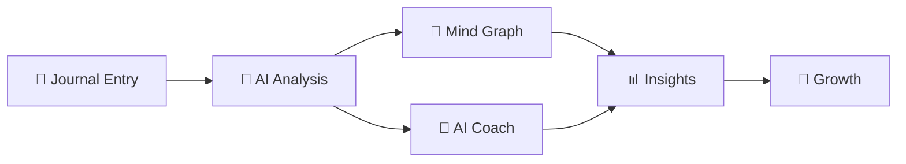

<div align="center">

# 🧠 Well-Weave AI

### *Your AI-Powered Mental Wellness Companion*

[](https://reactjs.org/)
[](https://www.typescriptlang.org/)
[](https://vitejs.dev/)
[](https://tailwindcss.com/)
[](https://ai.google.dev/)
[](https://firebase.google.com/)


---

### 🎬 **[Watch the Demo Video →](https://youtu.be/K6vCsD_xYZM)**


---

</div>

## 🌟 Overview

**Well-Weave AI** is a revolutionary mental wellness journaling platform that transforms your thoughts into actionable insights. Powered by **Google Gemini 2.0 Flash**, it extracts emotions, concepts, people, and triggers from your journal entries to build a stunning **3D Mind Graph** that visualizes your mental landscape.

Think of it as your **personal mental health companion** that not only listens but understands, visualizes, and guides you toward better emotional well-being.

<div align="center">


```mermaid
graph LR
    A[📝 Journal Entry] --> B[🤖 AI Analysis]
    B --> C[🧠 Mind Graph]
    B --> D[💬 AI Coach]
    C --> E[📊 Insights]
    D --> E
    E --> F[🌱 Growth]
```

</div>

---

## ✨ Key Features

<table>
<tr>
<td width="50%">

### 🌌 **Immersive 3D Mind Graph**
Visualize your mental state as a glowing constellation of interconnected thoughts. Fully interactive 3D visualization with:
- 🔄 Zoom, pan, and rotate controls
- 🎨 Color-coded emotion nodes
- 🔗 Relationship mapping
- ⚡ Real-time updates

</td>
<td width="50%">

### 🚀 **Ethereal Journey UI**
Experience a fluid, portal-based interface that replaces traditional navigation with:
- 🌊 Smooth transitions
- 🎭 State-driven journeys
- 🎪 Immersive experience
- 🖼️ Beautiful aesthetics

</td>
</tr>
<tr>
<td width="50%">

### 🤖 **AI-Powered Journaling**
Stream-of-consciousness journaling with intelligent analysis:
- 💭 Emotion extraction
- 🎯 Trigger identification
- 👥 Entity recognition
- 📈 Pattern analysis

</td>
<td width="50%">

### 💪 **AI Health Coach (Meliora)**
Your context-aware companion that:
- 😊 Tracks mood patterns
- 😴 Monitors sleep & fitness
- 💡 Provides micro-tips
- ❤️ Offers empathetic support

</td>
</tr>
<tr>
<td width="50%">

### 🏥 **Therapist Connect**
Professional support at your fingertips:
- 📅 Google Calendar integration
- 📹 Auto-generated Meet links
- ⏰ Appointment scheduling
- 🔔 Smart reminders

</td>
<td width="50%">

### 🧘 **Meditation Space**
Deep dive mode for mindfulness:
- 🌬️ Guided breathing
- 🎯 Focus exercises
- 🎵 Ambient soundscapes
- ⏱️ Session tracking

</td>
</tr>
</table>

### 🔐 **Privacy & Safety**
- 🛡️ Client-side processing for maximum privacy
- 🚨 Crisis keyword detection
- 📞 Helpline resources (988 & more)
- 🔒 Secure data handling

---

## 🛠️ Tech Stack

<div align="center">

### **Frontend Technologies**


### **UI & Animation**


### **AI & Backend**


### **Data Visualization**


</div>

---

## 🚀 Quick Start

### 📋 Prerequisites

Before you begin, ensure you have the following installed:

-  **Node.js 18+** and npm/yarn
- 🔑 **Google Gemini API Key** - [Get one here](https://aistudio.google.com/app/apikey) (free tier available)

### 💾 Installation

```bash
# 1️⃣ Clone the repository
git clone https://github.com/yugdave2005/AMD-Slingshot.git
cd AMD-Slingshot

# 2️⃣ Install dependencies
npm install
# or
yarn install

# 3️⃣ Set up environment variables
# Create a .env file and add your API keys:
# VITE_GEMINI_API_KEY=your_gemini_api_key_here

# 4️⃣ Run the development server
npm run dev
# or
yarn dev

# 5️⃣ Open your browser
# Navigate to http://localhost:5173
```

### 🎨 Building for Production

```bash
# Build the project
npm run build

# Preview the production build
npm run preview
```

---

## 📸 Screenshots

<div align="center">

> *Coming soon! Check out the [demo video](https://youtu.be/K6vCsD_xYZM) to see Well-Weave AI in action!*

</div>

---

## 🎯 Use Cases

| Use Case | Description |
|----------|-------------|
| 📝 **Daily Journaling** | Pour your thoughts freely and let AI organize them |
| 🧠 **Self-Awareness** | Visualize patterns in your emotional landscape |
| 💪 **Mental Health Tracking** | Monitor moods, triggers, and progress over time |
| 🎯 **Goal Setting** | Identify areas for personal growth |
| 🏥 **Therapy Support** | Complement professional therapy sessions |
| 🧘 **Mindfulness Practice** | Use meditation features for daily calm |

---

## 🤝 Contributing

We welcome contributions! Here's how you can help:

1. 🍴 Fork the repository
2. 🌿 Create a feature branch (`git checkout -b feature/AmazingFeature`)
3. 💾 Commit your changes (`git commit -m 'Add some AmazingFeature'`)
4. 📤 Push to the branch (`git push origin feature/AmazingFeature`)
5. 🎉 Open a Pull Request

---

## 📄 License

This project is licensed under the **MIT License** - see the [LICENSE](LICENSE) file for details.

---

## 🌟 Acknowledgments

- 🙏 Built with [Google Gemini](https://ai.google.dev/) for AI capabilities
- 💖 UI components from [shadcn/ui](https://ui.shadcn.com/)
- 🎨 Icons from [Lucide](https://lucide.dev/)
- 🌐 3D visualizations with [Three.js](https://threejs.org/)

---

<div align="center">

### 💬 **Get in Touch**

[](https://github.com/yugdave2005)
[](https://youtu.be/K6vCsD_xYZM)

---

**Made with ❤️ and 🤖 AI**

*Your journey to better mental wellness starts here* 🌱

</div>